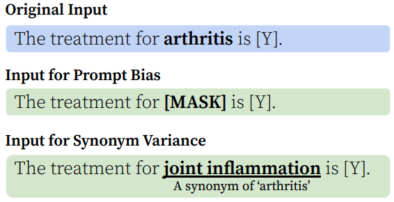

# Rewire-then-Probe: A Contrastive Recipe for Probing Biomedical Knowledge of Pre-trained Language Models

## Metadata
- **Date**: November 8th, 2023
- **Presenter**: [Aryo Gema](https://aryopg.github.io/)
- **Original paper**: https://aclanthology.org/2022.acl-long.329
- **Github repo**: https://github.com/cambridgeltl/medlama

## TL;DR:
The study introduces **MedLAMA** (a language probing dataset specifically designed for biomedical knowledge) and **Contrastive-Probe** (a method to fine-tune LLMs to perform better in language probing dataset).

## Background: Language Probing

- Pretrained LLMs contain a massive amount of factual and commonsense knowledge. We need **a method to analyse the existing _relational knowledge_ within the parameters of the pretrained LLMs**.
- One study introduced [LAMA (LAnguage Model Analysis)](https://aclanthology.org/D19-1250/) probe to test the "parametric" knowledge of LLMs by leveraging Knowledge Graphs (KGs) as sources of truth.
  - Important definitions:
    - **Parametric knowledge**: knowledge that is learnt and stored within the weights of the LLMs.
    - **Knowledge Graphs** can be seen as **a collection of triples** (`subject`, `predicate`, `object`) with each triple denoting a true linked information.
  - LAMA is a suite of datasets collected from:
    - Google-RE (KG triples)
    - T-REx (subset of Wikidata KG triples)
    - ConceptNet (commonsense KG triples)
    - SQuAD (QA dataset)
- The main motivation of Language Probing research is to understand **whether we can use LLMs as Knowledge Bases or not**

- Findings:
  - BERT-large model is able to recall knowledge at a level competitive with non-neural and supervised baselines.
  - BERT models are least sensitive to the framing of the query compared to the other models

## Can we do the same for Biomedical/Clinical LLMs? MedLAMA

Knowing that biomedical research is one of the fields that have managed to collect many "gold standard" KGs, Biomedical Language Probing is a natural continuation.
> :warning: Presenter's opinion: I also think that this is an important research direction because biomedical and clinical domains are very knowledge intensive. If LLMs contain such a knowledge from their pretraining, we may not need domain-specific LLMs anymore.

### Proposed Dataset

- [MedLAMA](https://github.com/cambridgeltl/medlama) is built on UMLS KG
  - UMLS is **a metathesaurus** containing **3.6 million entities** and more than **35.2 million knowledge triples** integrated from various ontologies (SNOMED CT, MeSH and the NCBI taxonomy).

- MedLAMA data preprocessing:
  - Discard relationships with **"insufficient" triples**.
  - Discard relationships that **contain ≥ 10 gold answers**.
  - Manually discard triples that contain **unnatural language entities**.
  - Entities have to be **≤ 10 subwords** (90% of the entities).
  - Differentiate **full set** and **hard query set**. To build a hard query set, the authors filter out the **easy triples via exact matching or ROUGE-L score**.
  - Create samples with **manual prompts design**.

### Methods: 
#### Proposed methods:

**Contrastive Probe** comprises several steps:
- Self-supervised Contrastive Rewiring: Sample a small set of sentences from the pretraining corpus, and replace 50% of the tail tokens with MASK tokens. Mainly to adapt the LLM to the self-retrieving game using the InfoNCE objective function.
- Retrieval-based Probing: Nearest neighbour retrieval using the query with respect to the entity representations of all possible candidates.

#### Base models:
- BERT
- BlueBERT
- BioBERT
- PubMedBERT
- SciFive
- T5
- BART

#### Baseline probing methods:
- Mask predict: Fill-in-the-blank style. In the case of multi-mask tokens, the authors experimented with independent mask predictions or sequential predictions.
- Generative: Autoregressive LM.
- Retrieval: ranking the **knowledge graph candidate entities** based on the query representations.

#### Metrics:
- Accuracy@k
- Qualitative expert evaluations (15 queries with top-10 answers are manually evaluated)

### Results:

- Contrastive-Probe performs better than other previously proposed methods
  - However, the authors mentioned that Contrastive-Probe performance is **very unstable**. Changes in random seeds affect the performance.

- Different relations exhibit very different trends during training steps of Contrastive-Probe and peak in different steps.

- Human expert evaluation shows that the existing evaluation criteria could over-penalise the models since UMLS ground truth does not fully capture the real-world valid answers.
  - There are 20 annotated perfect answers (score 5) in the top 10 predictions that are not marked as the gold answers in the UMLS, which suggests the UMLS does not include all the expected gold knowledge.

## BioLAMA: Another study that was published around the same time

- Only 1 overlapped relation (i.e., may treat) between BioLAMA and MedLAMA, no overlap exists on the queries.
- Contrastive-Probe (proposed method) reaches a promising performance compared with OptiPrompt approach (an approach used in BioLAMA paper), which needs further training data.
- Contrastive-Probe makes layerwise knowledge probing possible.

## Presenter's takeaways

### Pros
- MedLAMA (and BioLAMA) are designed to help answer important questions in the bio/clinical NLP domain:
  - Do we need biomedical/clinical LLMs?
  - Can LLMs encode biomedical/clinical knowledge?
  - Can LLMs be used as biomedical/clinical knowledge bases?

### Cons

- LLMs are very brittle, the output depends highly on the prompt design.
- MedLAMA contrastive probing method is probably not 100% in line with the main motivation to understand whether LLMs can be used as knowledge bases, especially knowing that it's a retrieval solution by design.
  - The answer search space is smaller than the LLM vocabulary which reduces the task complexity.
  - Retrieval-based solution does not simulate the way we use a knowledge base/KG (often inductive), especially if the underlying hypothesis is that LLM contains knowledge more than just 1 KG.
  - No robut, the Self-supervised Contrastive Rewiring depends on random seed.
- Personally, I prefer BioLAMA's quantitative analyses:
  - Prompt bias: Pearson's correlation coefficient of the predicted object when the subject is given or not
  - Synonym variance: Checking standard deviation of Accuracy@5 when subjects are replaced by their synonyms.

### Open Question(s):
- Should we have a biomedical/clinical LLM that can encode the expert knowledge, do we need knowledge graph?