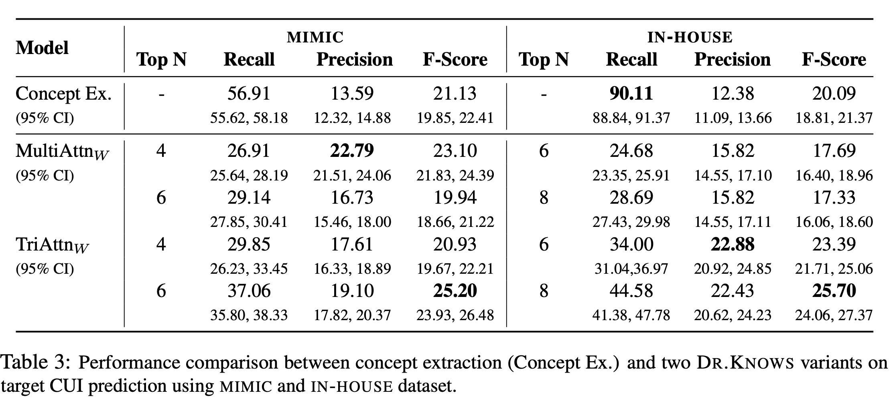

# ****Large Language Models and Medical Knowledge Grounding for Diagnosis Prediction****

## Metadata

- **Date**: 2024/2/1
- **Presenter**: [Ruizhe Li](https://www.ruizhe.space/)
- **Original paper**: [Large Language Models and Medical Knowledge Grounding for Diagnosis Prediction](https://www.medrxiv.org/content/10.1101/2023.11.24.23298641v1)

## TL;DR:

This paper proposed a Diagnostic Reasoning Knowledge Graphs (DR.KNOWS) model to retrieve top N case-specific knowledge paths about the pathology of diseases through a multi-hop mechanism, and then adapt the predicted paths into a graph-prompting method for LLMs. In addition, this paper developed the first comprehensive human evaluation approach to assess the performance of LLMs for diagnosis prediction.

## Background

- Electronic Health Records (EHRs)
    - EHRs includes a comprehensive information of patients, e.g., condition status, diagnoses, and treatment plans
    - The complexity and verbosity of EHRs with redundant diagnostic information presents the risk of cognitive overload for clinicians, which may lead to misdiagnosis
    - Physicians often skip sections of lengthy and repetitive notes and rely on decisional shortcuts
- MIMIC-III dataset
    - a subset of 1005 progress notes from MIMIC-III with active diagnoses annotated from the Plan sections
- Unified Medical Language System (UMLS)
    - concept vocabulary and semantic relationship used to construct medical knowledge graphs (KGs)
    - However, search space within a KG is too large containing 4.5M concepts and 15M relations
    - the number of concept in UMLS KG within one hop ranges from 2 to 33K, with a median of 368
- SOAP format for daily progress notes
    - Subjective: patient’s self-reported symptoms, concerns, and medical history
    - Objective:  structural data collected by healthcare providers during observation or examination, such as vital signs (e.g., blood pressure, heart rate), laboratory results, or physical exam findings
    - Assessment: the patient’s overall condition with a focus on the most active problems/diagnoses for that day
    - Plan:  multiple subsections, each outlining a diagnosis/problem and its treatment plan

## Datasets

- MIMIC-III subset
    - ICU patients
    - 1005 progress notes with diagnoses annotated from the Plan sections [Gao et al. 2022](https://arxiv.org/abs/2208.08408)
- IN-HOUSE dataset
    - 4815 progress notes
    - pull out concepts that belonged to the semantic type of T047 DISEASE AND SYNDROMES
    - including Emergency Department, General Medicine Wards, Subspecialty Wards, etc

## Method

### Task
Our task is to predict the list of problems and diagnoses that are part of the Plan section.

### UMLS KG

- We focused on the Systematized Nomenclature of Medicine-Clinical Terms (SNOMED CT)
- The UMLS medical concept is highlighted in the color boxes
- The darker color the vertices are, the more relevant they are to the input description
- Each UMLS medical concept is assigned a unique SNOMED concept identifier (CUI) from the clinical terminology system
- Concept Extractor: [cTAKES](https://www.ncbi.nlm.nih.gov/pmc/articles/PMC2995668/) and [QuickUMLS](https://github.com/Georgetown-IR-Lab/QuickUMLS)

### Model

### Prompting for LLMs

- output customization prompt: specifies the requirement of exploiting knowledge paths
    - Non-Subject-Matter Prompts: designed by a non-medical domain expert (computer scientist)
    - Subject-Matter Prompts: developed by a medical domain expert (a critical care physician and a medical informaticist)
    - Use BETTERPROMPT approach to evaluate the quality of designed prompts based on perplexity scores
- context control patterns: directly linked to the DR.KNOWS’s output

### Evaluation

#### Automatic Evaluation

- Recall@N, Precision@N, F1@N, Rouge 2 and Rouge L

#### Human Evaluation

- Diagnostic evaluation
    - Accuracy: capture the factuality of the diagnostic output as well as penalize a model for hallucinating output that does not qualify as a diagnosis
    - Plausibility: conditional on accuracy, was intended to capture the potential for harm present in an inaccurate diagnosis
    - Specificity: conditional on plausibility, is defined as the level of detail provided in the diagnosis
    - Omission and uncertainty: defined cases when a diagnosis is not included in the list of outputted diagnoses but would be considered by a clinician in the clinical setting based upon the input data
        - aleatoric uncertainty: when LLM has been provided with the necessary information but has not utilized it
        - epistemic uncertainty: when the input to LLM does not contain the data needed to make a diagnosis

- Diagnostic reasoning evaluation
    - Reading comprehension: capture if a model understood the information in a progress note
    - Rationale: capture the inclusion of incorrect reasoning steps
    - Recall of Knowledge: capture the hallucination of incorrect facts as well as the inclusion of irrelevant facts in the output
    - Omission: capture when the model failed to support conclusions or provide evidence for a diagnostic choice

- Abstraction: This was to ascertain how the knowledge paths influenced the type of output produced and whether or not the model was able to use abstraction
    - Effective abstraction: determine if any of the abstracted output aided or hindered the reasoning

#### Results

- Human evaluation indicated that the presence or absence of DR.KNOWS did not yield an overall difference in performance (p=0.63); however, several subgroup components were different
- ChatGPT models with and without KG paths exhibited similar performance in ACCURACY, OMISSION, UNCERTAINTY, PLAUSIBILITY, and SPECIFICITY.
    - concerning the level of ABSTRACTION, ChatGPT with KG did not favor more extractive diagnoses than ChatGPT without KG, scoring 87% compared to 81% for "No" answers (p=0.09)
- When it comes to RATIONALE (correct reasoning), ChatGPT with KG exhibits a 55% strong agreement with humans, while ChatGPT “No KG” demonstrates 50% strong agreement (p<0.01)
- On the ABSTRACTION category asking about the presence of abstraction in model output, there was a notable drop from 88% ("No KG") to 78% ("KG") in the affirmative responses (p=0.03), indicating less abstraction required with KG paths.
- Differences were also noted in EFFECTIVE ABSTRACTION in favor of the KG paths (p<0.01).

### Case Study

- when DR.KNOWS retrieved the correct knowledge paths and ChatGPT utilized it well, there was an improvement in the output quality
    - This led to higher PLAUSIBILITY scores from human evaluators in the Figure 8

- two primary types of error in DR.KNOWS output
    - ChatGPT did not find the provided knowledge paths useful.
    - when DR.KNOWS selected the source CUIs that were less likely to generate pertinent pathways for clinical diagnoses, resulting in ineffective knowledge paths

### Presenter's takeaways

#### Pros

- Retrieved knowledge path enhanced ChatGPT's performance according to automated evaluation and improved in Abstraction and Rationale according to human evaluation
- A comprehensive human evaluation approach to assess the performance of LLMs for diagnosis prediction

#### Cons
- A better way to improve ChatGPT's performance about omission
- The alignment between automated evaluation and human evaluation is not good enough
- A stronger KG to recognise KGs which are not related to the input patient representation
- How to better model the relations between symptoms and disgnoses
- How to instruct ChatGPT to better incorporate certain beneficial KGs

